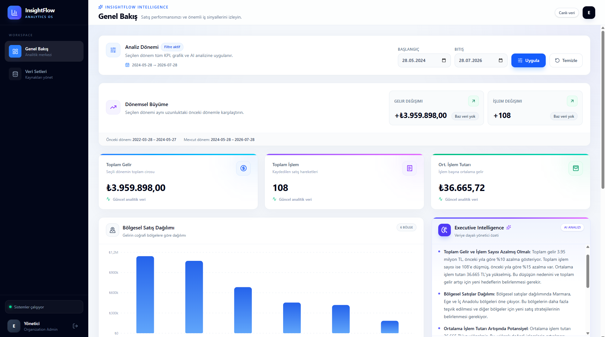
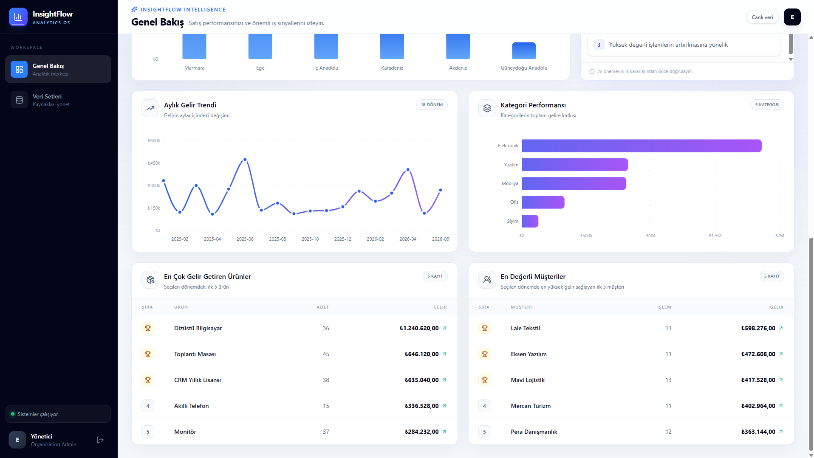
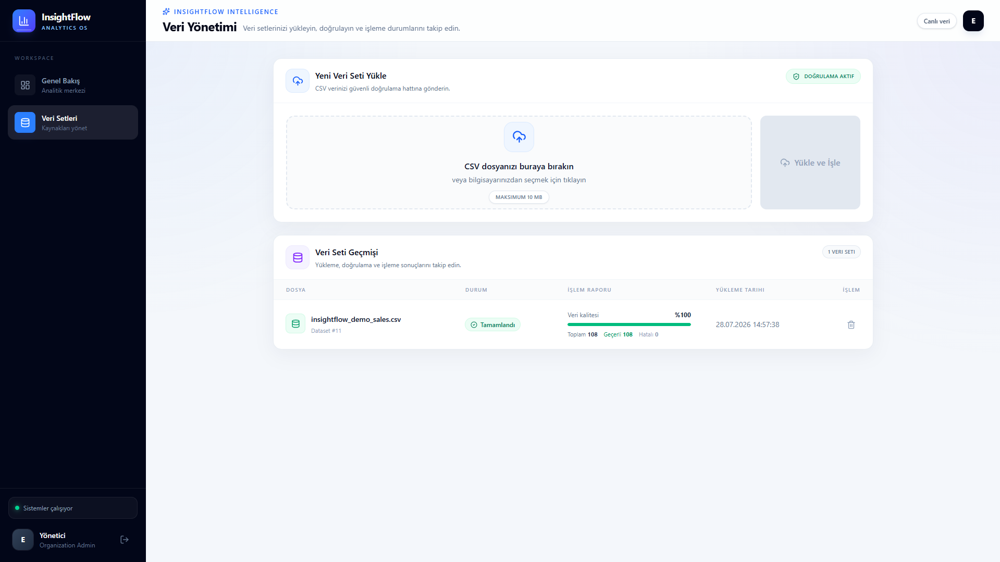
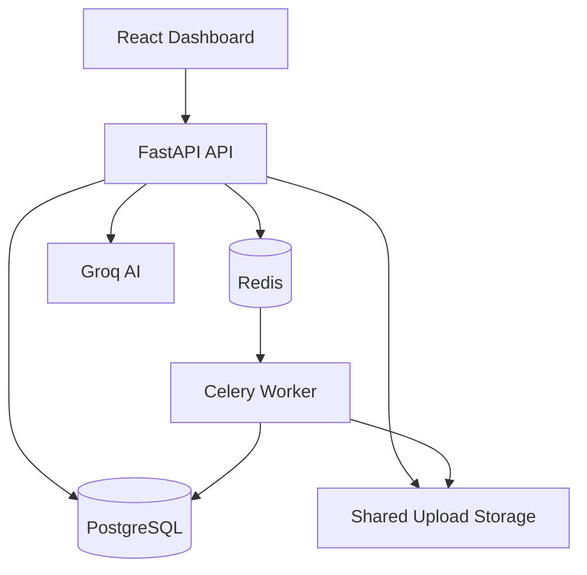

# InsightFlow

[](https://github.com/eminosmanatci/insightflow/actions/workflows/ci.yml)
[](https://github.com/eminosmanatci/insightflow/releases/latest)
[](https://www.python.org/)
[](https://fastapi.tiangolo.com/)
[](https://react.dev/)
[](https://www.docker.com/)

Enterprise analytics platform that transforms validated CSV sales data into interactive dashboards, period comparisons, product and customer rankings, and AI-powered executive insights.

## Product Overview

InsightFlow provides an end-to-end business analytics workflow:

1. Users register and create an organization.
2. CSV datasets are uploaded through the web interface.
3. Files are stored in shared persistent storage.
4. Celery workers validate and process uploads asynchronously.
5. Valid sales records are persisted in PostgreSQL.
6. Tenant-scoped analytics services calculate business metrics.
7. The React dashboard visualizes the results.
8. Groq generates data-driven executive summaries.

All datasets and analytics queries are isolated by organization.

## Screenshots

### Executive Dashboard



### Analytics Details



### Dataset Management



## Key Capabilities

### Data Ingestion and Quality

- Secure CSV upload workflow
- Strict schema and business-rule validation
- Duplicate file detection using file hashes
- Persistent shared upload storage
- Background processing with Celery and Redis
- Valid, invalid and total row reporting
- Safe cleanup after processing failures
- Dataset deletion with analytics synchronization

### Analytics

- Total revenue
- Transaction count
- Average transaction value
- Revenue by region
- Monthly revenue trends
- Category performance
- Product performance rankings
- Customer value rankings
- Period-over-period revenue growth
- Period-over-period transaction growth
- Inclusive date filtering

### AI Insights

- Groq-powered executive business summaries
- KPI and regional context in prompts
- Date-filtered AI analysis
- Graceful demo mode without a production API key
- Safe provider failure handling
- Typed AI response contracts

### Security and Isolation

- JWT authentication
- Password hashing
- Organization-based tenant isolation
- Role-based user model
- Protected frontend routes
- Tenant-scoped datasets and sales records
- Tested cross-organization access boundaries

## Architecture



### Analytics Service Layer

```text
backend/app/services/analytics/
├── queries.py          # Tenant scope and date filtering
├── aggregations.py     # Shared period aggregations
├── metrics.py          # KPI and regional metrics
├── trends.py           # Monthly and category analytics
├── rankings.py         # Product and customer rankings
└── growth.py           # Period-over-period comparison
```

FastAPI routers handle HTTP validation and response contracts, while business logic remains in dedicated service modules.

## Technology Stack

| Layer | Technologies |
|---|---|
| Backend | Python 3.11, FastAPI, Pydantic |
| Database | PostgreSQL, SQLAlchemy |
| Migrations | Alembic |
| Processing | Pandas, Celery, Redis |
| AI | Groq, Llama 3.1 |
| Frontend | React, Vite, Tailwind CSS |
| Visualization | Recharts |
| Authentication | JWT, OAuth2 password flow, Passlib |
| Infrastructure | Docker, Docker Compose |
| Quality | Pytest, pytest-cov, ESLint, GitHub Actions |

## CSV Format

InsightFlow expects UTF-8 CSV files with the following columns:

```csv
date,region,category,customer,product,quantity,price,total
2026-01-10,Marmara,Elektronik,Anka Teknoloji,Dizüstü Bilgisayar,1,34500,34500
```

Validation rules include:

- `date`: `YYYY-MM-DD`
- `region`, `category`, `customer`, `product`: non-empty text
- `quantity`: positive integer
- `price`: positive numeric value
- `total`: must equal `quantity × price`

## Getting Started

### Prerequisites

- Docker
- Docker Compose
- Git

### 1. Clone the repository

```bash
git clone https://github.com/eminosmanatci/insightflow.git
cd insightflow
```

### 2. Configure environment variables

Copy the example environment file:

```bash
cp .env.example .env
```

PowerShell:

```powershell
Copy-Item .env.example .env
```

Update the values in `.env`, especially:

```env
DATABASE_URL=postgresql://insight_admin:your_password@db:5432/insightflow_prod
SECRET_KEY=replace-with-a-secure-random-secret
GROQ_API_KEY=gsk-your-api-key
CELERY_BROKER_URL=redis://redis:6379/0
CELERY_RESULT_BACKEND=redis://redis:6379/0
UPLOAD_DIR=/data/uploads
```

### 3. Start the platform

```bash
docker compose up -d --build
```

### 4. Apply database migrations

```bash
docker compose exec backend alembic upgrade head
```

### 5. Open the application

| Service | URL |
|---|---|
| Frontend | http://localhost:5173 |
| Swagger API documentation | http://localhost:8000/docs |
| OpenAPI schema | http://localhost:8000/openapi.json |

## Development Commands

### Backend tests and coverage

```bash
docker compose exec backend pytest \
  --cov=app \
  --cov-report=term-missing \
  --cov-fail-under=90 \
  -q
```

Current release quality:

- 62 backend tests
- 95.39% backend coverage
- 90% CI coverage gate

### Migration consistency

```bash
docker compose exec backend alembic check
```

### Frontend quality

```bash
docker compose exec frontend npm run lint
docker compose exec frontend npm run build
```

### Application logs

```bash
docker compose logs backend
docker compose logs celery_worker
docker compose logs frontend
```

## Continuous Integration

GitHub Actions validates every push and pull request to `main`.

The pipeline includes:

- Backend tests
- Minimum 90% coverage gate
- PostgreSQL migration application
- Alembic consistency check
- Frontend dependency installation
- ESLint validation
- Production frontend build

Workflow: [InsightFlow CI](https://github.com/eminosmanatci/insightflow/actions/workflows/ci.yml)

## API Highlights

| Method | Endpoint | Description |
|---|---|---|
| POST | `/auth/register` | Register a user |
| POST | `/auth/login` | Obtain a JWT |
| POST | `/organizations/` | Create an organization |
| GET | `/organizations/me` | Get the current organization |
| POST | `/datasets/upload` | Upload and queue a CSV dataset |
| GET | `/datasets/` | List tenant datasets |
| DELETE | `/datasets/{id}` | Delete a tenant dataset |
| GET | `/analytics/kpis` | Get KPI summary |
| GET | `/analytics/regions` | Get regional revenue |
| GET | `/analytics/monthly` | Get monthly trend |
| GET | `/analytics/categories` | Get category performance |
| GET | `/analytics/products` | Get product rankings |
| GET | `/analytics/customers` | Get customer rankings |
| GET | `/analytics/growth` | Compare equal-length periods |
| GET | `/ai/analyze` | Generate an executive AI summary |

The analytics and AI endpoints support optional `date_from` and `date_to` query parameters.

## Release

The current stable portfolio release is [InsightFlow v1.0.0](https://github.com/eminosmanatci/insightflow/releases/tag/v1.0.0).

## Roadmap

The v1.0.0 application scope is complete. Potential future improvements include:

- Production cloud deployment
- Interactive AI analytics chat
- ERP and CRM connectors
- Scheduled reports
- Observability and centralized logging
- Additional dashboard export formats

## Author

**Emin Osman Atcı**

Computer Engineer focused on Python backend development, data engineering and AI integration.

- [GitHub](https://github.com/eminosmanatci)